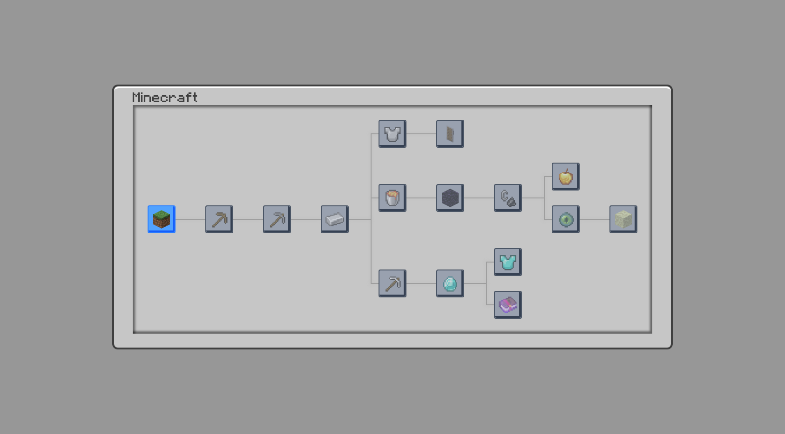
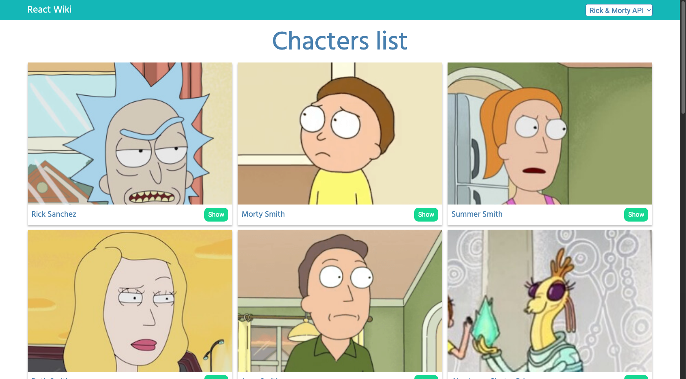

**Full Stack Developer | Software Engineering Student**

Bilingual developer with experience in both LATAM and North American companies. Passionate about creating efficient and scalable solutions, with a strong focus on frontend development and growing backend expertise. Currently exploring cloud computing and system architecture while pursuing a Software Engineering degree.

## 🚀 Featured Projects 

_Here are my main projects that showcase my current skills:_

### Minecraft Achievement Tree

Interactive achievement system inspired by Minecraft's progression | [Live Demo](https://feat-fixes.d17kq6ng6c4wtc.amplifyapp.com/)

`React` `TypeScript` `Redux Toolkit` `AWS Amplify`

### Characters Wiki

Dynamic wiki exploring animated series characters | [Live Demo](https://react-wiki-1297f.web.app) | [Repo](https://github.com/SebastianBC09/React-Wiki-Project)

`React` `TypeScript` `Redux Saga` `Firebase`

## 🔧 Project Portfolio

### 🌐 Web Applications
#### React-based Projects
- Comics Platform - Mobile-first comics browser with .NET backend
  - **Frontend:** [Repository](https://github.com/SebastianBC09/ComicsApp)  
    `React` `TypeScript` `Ionic`
  - **Backend:** [Repository](https://github.com/SebastianBC09/ComicsAppAPI)  
    `.NET Framework` `C#` `SQLite`

- Hello-Build - Full-stack application with GraphQL integration
  - **Frontend:** [Repository](https://github.com/SebastianBC09/Hello-Build)  
    `React` `TypeScript` `OAuth` 
  - **Backend:** [Repository](https://github.com/SebastianBC09/Hello-Build-API)  
    `Node.js` `Express` `GraphQL`

- Image Gallery - Modern single-page application for image browsing
  - **Frontend:** [Repository](https://github.com/SebastianBC09/-image-gallery-spa)
    `React` `TypeScript` `Tailwind CSS`

### 💻 Desktop Applications
### AgroTech Suite
Agricultural management system with data processing capabilities
  - **Main App:**  `Java` `JavaFX` | [Repository](https://github.com/SebastianBC09/AgroTech2.0-App)
  - **Data Processor:** `Java` `Data Processing` | [Repository](https://github.com/SebastianBC09/AgroTech-Data-Processor)

### ATM System
Comprehensive banking simulation | [Repository](https://github.com/SebastianBC09/ATM-Java)

`Java` `OOP Principles` `UML Diagram`

## ⚙ Tech Stack

| Programming Languages |
| -------------------- |
|      |

| Frontend Development |
| ------------------- |
|         |

| Backend Development |
| ------------------ |
|      |

| Databases |
| --------- |
|    |

| Web Fundamentals |
| --------------- |
|      |

| Tools & Platforms |
| ---------------- |
|      |

# 📊 GitHub Stats

| *GitHub Stats* | *Streak Stats* | *Programming Languages* | 
| -------------- | -------------- | ----------------------- |
|  |  | 

## 🏆 GitHub Trophies

### 🔝 Top Contributed Repo

## 📬 Let's Connect!

I'm always interested in connecting with fellow developers and tech enthusiasts! Whether it's discussing code, sharing ideas, or exploring collaboration opportunities, feel free to reach out through any of these platforms:

## 📨 Contact

Looking to discuss a project, explore job opportunities, or just want to say hi? Feel free to reach out! I'm always open to interesting conversations and new opportunities.

