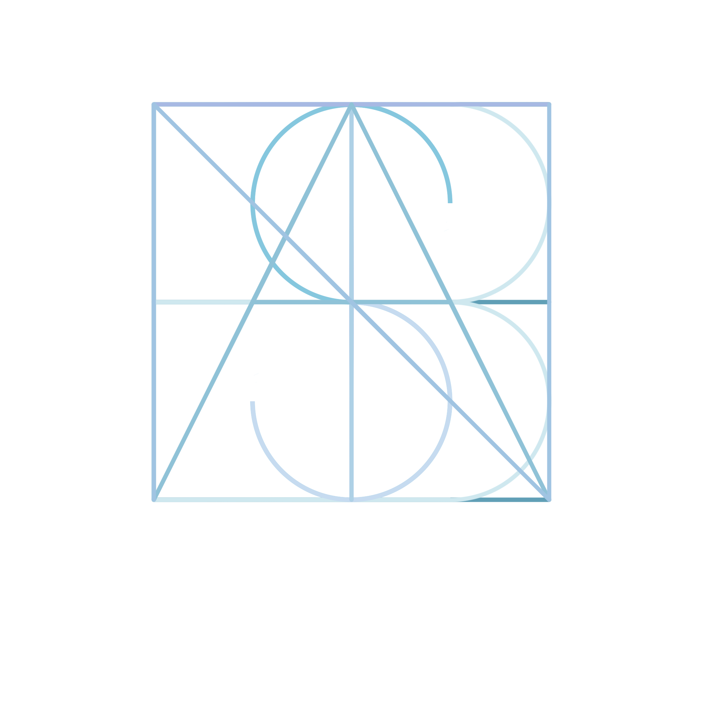

 </a>

<h1 align=center>Hi there 👋! I'm Sebastian Ballen  Welcome to my profile, thanks for passing by😃</h1>
 

&nbsp;&nbsp;&nbsp;&nbsp;
  &nbsp;&nbsp;&nbsp;
  &nbsp;
  &nbsp;&nbsp;&nbsp;&nbsp;

<h1 align="center">About me 👨‍💻</h1>

Frontend developer, specialized in web technologies like ReactJS, JavaScript, HTML, CSS, SASS, Bootstrap & more. Focused in create quality and high-performance software. Self-taught, I love learning about tech & desing.

---

## Projects 🚀

I really like doing personal projects related to frontend development & some backend too. My favorite libary or framework is ReactJS but I also have worked with JavaScript vainilla & Jquery.  
Some of my projects: 

<li> <a href="https://github.com/OgmaCapStone/ogma-client">Ogma App</a></li>

---

<h3>👨‍💻 Skills</h3>

---

<h3>GitHub Stats</h3>

